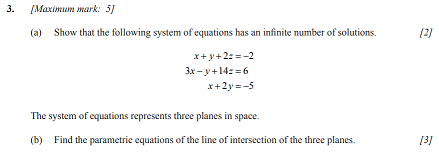
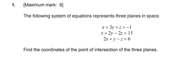
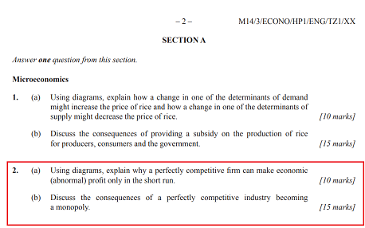
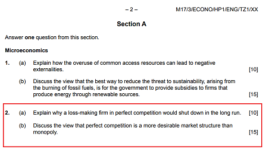

The International Baccalaureate Diploma Program (IBDP) is a two-year educational programme that provides internationally accepted qualification
for entry into higher education. Generally, many international schools around the world use the IB program.

(From here on out, I will assume that you have either taken the IB before or have a general idea about the course).

So if we look at the statistics, the global average score for the IB is 29.65 points total in the May 2019 examinations. Meanwhile, the Hong Kong average is 35.99.
I'm sure there have been many articles that have talked about how Hong Kong students [rank among the world's top ten in standardized testing](https://www.oecd.org/pisa/publications/pisa-2018-resultshtm.htm). However, I'm here to talk about why specifically, certain schools in Hong Kong are able to excel in th IB diploma program. In particular, I will talk about my own secondary school, [Sha Tin College](https://shatincollege.edu.hk/), which achieved the best results among any IB school in Hong Kong during the May 2019 examinations, with 11 students achieving 45 points, myself included. 

Fun fact: I looked up the figures for the number of students that scored 45 points in the May 2019 examinations. In total, there were 275 students that scored a 45 globally, 36 of those came from Hong Kong. 

Ok so that's enough of tooting my own horn. What's going on here? Why are the numbers showing this?

<h2>Cram School Culture</h2>

Those who have lived in Hong Kong or know a bit about Hong Kong will know that the cram school industry in Hong Kong in huge. SO many parents are willing to spend money on their children outside of the regular tuition. While it may seem crazy to people who live in western countries, but tutoring in Asian countries is not some university student trying to earn some money and tutoring kids no. Tutoring centers, especially ones that have established for a long time, know the exams inside out, which is essential for the IB exams. Whether it be [NTK Academic Group](https://www.ntk.edu.hk/en/) and [i-Study Learning Centre](http://istudy.com.hk/) for international exams like IB, SAT, IGCSE, IELTS, or [英皇教育中心](http://www.kge.hk/tutorial/main/index.asp) for the HKDSE, these cram schools teach students how to take an exam, rather than giving them a full understanding of the concepts. For someone who wants to excel in the IB exams, I think this method of learning the exams is a more effective way of learning. 

WARNING: I am not advertising for these tutoring centres nor am I trying in any way to discredit or slander them, this is just my opinion don't sue me pls. 

> For someone who wants to excel in the IB exams, I think this method of learning the exams is a more effective way of learning. 

Why?

What we need to realize, is that the IB isn't very creative in giving out questions. Take a look at these two Math HL Paper 1's:

this one from May 2014 Timezone 2: 

and this one from May 2016 Timezone 2:

<b>NANI</b>! They're the same. wHaT. Yeah this is the IB. They are super lazy in test writing. In fact, from past experience from doing every single paper in every single timezone from May 2013 to Nov 2018, on average, the question styles of 9 out of 10 questions in a math paper has appeared before. That means that as long as you do every single math paper and understand it, you are guaranteed at least 90% in that math paper. For reference, the grade boundary for a 7 in Math HL May 2019 timezone 2 is 78%.

> It's that easy!

Of course, people always make careless mistakes so you may not get 90%. Heck, some people may get fooled by a trick question or two (ahem me). That is why having some understanding of math is still important to be able to at least get some points from the occasional curveball question that they throw at you. Because usually, those questions are practically unsolvable unless you have done something similar in some math competitions or you're just smart. Generally, the majority of candidates don't score high on those questions - and I know this because I read the occasional examiner reports that come attached with the markschemes. 

So what these tutoring centres do, is they drill the students with past papers. What if you do all the past papers available? Do you do them again. I know for a fact that NTK usually writes prediction papers in the months leading up to the exam so students can get that extra mock exam practice in. So are these prediction papers accurate? I wouldn't know since I haven't done them, but my guess is that they should be quite similar since the IB is quite predictable. Take another example from two different Economics HL paper 1's:

this one from May 2014 Timezone 1:  

and this one from May 2017 Timezone 1:

>Practically the same question.

For those who know about the economics course, you will know that in paper 1, there's only so many 10 mark and 15 mark questions that an examiner can ask. Sometimes they are left without a choice but to double up on questions - furthermore, candidates can choose which questions they want to answer. Tutors and teachers who realize this will know to tailor the way they teach to make sure that their students are prepared for at least half of the questions that may appear in the exam. Those who have taken econ before will know that the worst feeling is to get cheesed by a paper 1 question. 

<h2>Hard work pays off</h2>

Another factor that I am going to look at is the amount of time and effort that is put in by each and every candidate that gets a high score, regardless of who you are. This should not be disregarded.

Why do I say this? Because I believe that when it comes to IB, every effort counts. And this is coming from a lazy guy like me. The reasoning that I have for this is that everything counts in the IB. Every IA, every presentation, every homework, every essay. I think this is important because not everyone respects how much a little more effort can do. 

The logic behind the IAs and presentations are simple, if you put that little bit of extra work, you have a chance of getting that extra point or two, that may or may not result in pushing you over the next grade boundary. 

Sounds hypothetical, sounds farfetched, but it does matter at the end and you will regret it if you don't do it.

Don't be that guy. 

Homework and essays are different. They don't count towards your final grade. So what's the point? That's what you think. Remember, who marks your homework and grades your essays? Your teacher. Who gives you your predicted grades? Your teacher. Who grades your IAs? Your teacher. You see where I'm going with this? Doing well and trying hard in your homework while leave a good impression on your teacher, who may or may not be unconsciously biased when grading your IA and giving out predicted grades. I say may or may not because this doesn't always work. It could be that you were smart enough to get a 7 anyways without even trying in class, or it could be that your teacher is a big fat d*ck. Who knows. So you have to exercise your own discretion when making these decisions. 

In my case, for English LAL SL, I tried very hard for all essays and FOAs. I would like to think that I made a good impression on my teacher, which resulted in him giving me a 7 for my predicted grade even though I got 6s for my mock exams. What a homie - I did not disappoint him in the final. 

IAs are a little trickier, usually in all schools, after every single IA has been graded by your teacher, a select few of every class's IAs are internally moderated by all the teachers in the department. So favouratism is a little harder to pull off here, but then again, only a select few IAs are chosen and many of them are subjective anyways. 

The point I'm trying to make here, is that every point counts. And I think that the Asian culture of fighting for every point plays a big part in this. In my school, most students would try very hard to earn every extra point from the teachers because they know how important every point is, and also their parents will beat their ass if they don't. 

May seem trivial, but personally I felt like this contributed to my own final grade and those of my friends. So for anyone who's taking IB now, work hard and the results will show. 頑張って！

<h2>Don't believe in the numbers</h2>

I'm going to end off on this one. Remember how I rattled off a bunch of numbers about how high the Hong Kong average is compared the the global average? I'm not trying to make a statement that we're smarter or that we're more hardworking, no. There is definitely a reason for these skewed result. Compared to many other developed countries that ARE doing the IB, we see that the students that are doing the IB are from a different group. 

In Hong Kong, except for [ESF](https://www.esf.edu.hk/) (English Schools Foundation) schools, almost all other schools are not full IB schools. What this means is that their school has some of their students do the IB, while they have some other students do another high school-level program. For example, [DBS](https://www.dbs.edu.hk/) (Diocesian Boy's School), one of the most prestigious local schools in Hong Kong, only lets the top 60 or so students in the cohort to take the IB program. With such selectiveness, it is not surprising that the average IB score in DBS is 40.1 points, much higher than the average of ESF 

Meanwhile, having talked to some people at UCLA, I learnt that some high schools in the United States that do the IB program have students take the IB along with some AP classes. Now that's tough. It wouldn't be surprising that their average IB score was lower. 

Furthermore, the way higher education works in the US, is that once universities accept you in February-March, it's a binding contracting, meaning that no matter how low your scores are, you'll still be going to that university. Hence, meaning that your final exam and IB scores don't actually matter. On the other hand, for universities in the UK, Hong Kong, and Australia, conditional offers are given to applicants based on their scores, which means that you need to achieve a certain score to get into that university. This means that the students who apply to these universities are more likely to try harder in the final exam. Rip us. Since the majority of students who apply to these universities are going to be from that country, we can see why IB resuls in Hong Kong are so skewed. 

<h2>Conclusion: To wrap it up</h2>

So the main reasons why the difference in IB scores between Hong Kong and the global average is because of the existence of cram schools (and again I am not advertising for them), the hardwork of students due to cultural pressures, as well as the educational system that allows them to do so. 

I would like to say that these are purely my own opinions and they may or may not hold any truth in them. If you have read up to this point, I would like to thank you for putting up with my garbage English, this is the first time I've written actual English in a long time. 

For any of you who are currently taking the IB, feel free to contact me for any advice. I am happy to give any advice where I can, believe it or not, 45 isn't actually that hard to achieve. Good Luck!

