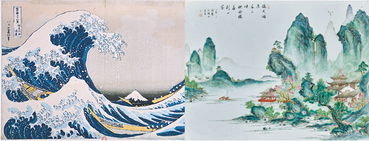

<i>Disclaimer: This paper was written for Linguistics 1 course at UCLA. It was edited a little to act as a blog post. Do not use this work without my permission or else you will be violating academic integrity.</i>

<h2>Introduction</h2>

A little bit of background about me: I have always spoken Mandarin with my family, so Mandarin is as much as a native language to me as English is. However, I grew up in Hong Kong, so I am very much familiar with Cantonese, which I consider a dialect of Mandarin. Since I studied at an international school in Hong Kong, I was taught Mandarin instead of Cantonese, hence which is why although I can speak and listen to Cantonese, I am more comfortable with reading and writing in Mandarin. Japanese is much more of a second language to me than English, Mandarin, and Cantonese. I have been self-teaching myself Japanese for the past 5 years, mainly learning through online tutorials, watching Japanese shows, and playing games in Japanese. 

<i>Note to readers:</i> This blog post will not talk about similar words in Chinese and Japanese that have resulted about because both words share the same kanji. Examples include: 
- 时间 ('jikan') and 时间（'shíjiān')
- 三 ('san') and 三 ('sān')
- 概念 ('gainen') amd 概念 ('gàiniàn')

or any sort of words that achieve a similar effect. The reason being that since both of these languages have similar roots, I will skip over talking about the obvious similarities in favor of looking at less commonly known points of comparison.

<h2>Comparison of Sounds</h2>

In this section, I will compare the use of tones in Chinese and Japanese. Intonation is a core part of Chinese phonology, hence it is an interesting point of comparison between the two languages. As someone who mainly listens to and reads Japanese, I am personally very interested in this topic. 

In Mandarin, there are five different tones when pronouncing a vowel. Usually, these sounds are marked using diacritics in pinyin, and even if a word uses the same IPA consonants and vowels, they will still be pronounced differently. An example of this are the words: 妈 (mother), 麻 (numb), 马 (horse), 骂 (scold), 吗 (particle that appears at the end of a question). These five characters are both pronounced using the IPA [ma], meaning that all 5 of these characters are pronounced with the voiced, bilabial, nasal stop [m] transitioning into the central low, unrounded tense vowel [a]. However, what differs is how the larynx (our vocal cords), changes the pitch of the vowel. We distinguish this change in pitch by adding IPA tone letters after the vowel – IPA diacritics can also represent tones, but I will use tone letters here. 

- 妈 [ma˥] corresponds to the first tone and is often called the "high tone". 
- 麻 [ma˧˥] corresponds to the second tone and is often called the "high rising tone". 
- 马 [ma˨˩˦] corresponds to the third tone and is often called the "low dipping tone". 
- 骂 [ma˥˩] corresponds to the fourth tone and is often called the "high falling tone". 
- 吗 [ma] is called the neutral tone, because it is "toneless" and does not have a special IPA tone letter.

However, Japanese is not classified as a tonal language. The tones at which the vowels are produced are mostly fixed. There are, however, some situations where the tone of the vowels change and that is the existence of suprasegmental vowels in Japanese. An example of a suprasegmental is the pitch drop denoted by [ꜜ]. 

So, an example will be [kaꜜki] (牡蠣 - 'oyster') and [kakiꜜ] (垣 - 'fence'), where the position of the [ꜜ] determines where the pitch drop occurs. Hence, even though both words have a voiceless, velar, oral stop [k] transitioning into a central low, unrounded tense vowel [a] and a front high, unrounded tense vowel [i], the position of the pitch drop will distinguish these words into completely different meanings. 

> An English approximation to this would be akin to the pitch difference between [mæri] (marry) and [məˈriː] (Marie).  

Hence, by using the intonation of vowels as a point of comparison between Chinese (Mandarin) and Japanese, we see that there is a large difference between the phonetics of the two languages. Japanese does not have the tonal range of vowels that Chinese has, which explains why native Japanese speakers cannot easily pronounce the common Chinese surname [Wa˧˥ng] (王 - "Wang") since the "high rising tone" does not exist in Japanese. 

However, there are similarities between Chinese and Japanese sound pronunciation. One point of interest is the similarity between the Chinese pinyin sounds 'x' [ɕ], 'q' [tɕʰ], and 'j' [tɕ] and the Japanese sounds 'sh' [ɕ], 'ch' [cɕ], and 'j' [dʑ], which are all palatal, while the English sounds 'sh' [ʃ], 'ch' [tʃ], 'j' [dʒ] are not. 

Taking 'x' and 'sh' as an example, the IPA is identical. So, for example, words like [ɕjau̯˨˩˦] (小 – "little") in Chinese and [sɨᵝɕi] (すし – "sushi"). The [ɕ] is a voiceless alveolo-palatal fricative that both native Chinese speakers and native Japanese speakers are comfortable with, but this sound doesn't exist in the English phonetic alphabet – the [ʃ] sound is a voiceless palate-alveolar fricative.  Hence, which explains why I, as a native Chinese speaker, had an easier time learning how to pronounce words in Japanese than some of my friends who were native English speakers. 

<h2>Comparison of Grammar</h2>

This section will compare the syntax of Chinese and Japanese by examining the sentence: "<i>My older brother bought a bird</i>". In Chinese and Japanese, this sentence looks like this: 

<h4>Chinese</h4>

| 我的  | 哥哥  |  买了  |  一只  |  鸟 |
|---|---|---|---|---|
| my  | older brother  | bought   | a   | bird  |

 

<h4>Japanese</h4>

|  私の | 兄が  |   鳥を |  買った  | 
|---|---|---|---|
| My   | older brother   | bird   |  bought  | 

> It is important to notice that in Japanese, the "が" and "を" are case markers, but I will treat them as part of the noun for simplicity. 

First of all, we can see that Chinese has very different phrase structure rules from Japanese. While Chinese is SVO (Subject- Verb-Object), Japanese is SOV (Subject-Object-Verb). From the above examples, we can see that although the NP structure for both languages is similar: 
>NP -> Det (my) + N (brother)

The difference lies in the VP phrase structure rules. As seen, while the Chinese verb phrase goes from 
> VP -> V (bought) + NP (a bird) 

where the head of the phrase precedes its complement; the Japanese verb phrase goes from 
>VP -> NP (bird) + V (bought)

where the head ("bought") of the phrase follows its complement ("bird"). 

Another difference between the two languages is that when it comes to singular nouns, while Chinese has a determiner: "一只" to signify "one bird", Japanese does not have a determiner. In Japanese, while you can specify singular nouns (一つ – "one / a"), it is uncommon to do so, and native speakers often use "bird" to refer to one or many birds in normal conversation even though it may be ambiguous. 

Now, moving on prepositional phrases, consider the sentence: "<i>my brother bought a bird in the city</i>".

<h4>Chinese</h4>

|  我的 | 哥哥   | 在城市里  |  买了  | 一只  | 鸟  |
|---|---|---|---|---|---|
| my  | older brother  | in the city  | bought  |  a   |   bird  |

 

<h4>Japanese</h4>

|  私の |  兄は | 街で  | 鳥を  |   買った | 
|---|---|---|---|---|
| My   | older brother  | in the city  |   bird |  bought | 

> An important thing to note is that in Chinese, "在XX里" is actually a determiner that translates into "in the XX". This is also reflected in Japanese in the form of the case markers that are stuck to the nouns "は" and "で". 

So, there is a similar structure in the PP structure of both languages. Aside from this, we see a similarity in the positioning of the PP "in the city". It seems that both Chinese and Japanese VP's put the prepositional phrase at the very front of a VP, which means that a Chinese VP (verb phrase) looks like this: 
>VP -> PP (in the city) + V (bought) + NP (a bird)

while a Japanese VP (verb phrase) looks like this: 
>VP -> PP (in the city) + NP (bird) + V (bought) 

So, to conclude, while Chinese and Japanese phrase structures have some similarities in: PP placement in a VP, NP structure, and PP structure, they have some differences in that the order of a verb and NP are swapped in a VP. From this we can see that in terms of syntax, Chinese, Japanese, and English are different yet similar at the same time. Of course, this is only the very basics, it turns out that Chinese and Japanese actually have a lot more similarities when we get to more complex sentence structures.

<h2>Language and Thought</h2>

A "Whorfian" view  would  argue  that  the  languages  CAUSE  their  speakers  to  think differently. This section discusses this view in terms of Chinese and Japanese.

In Japanese, there are honorifics that are attached to everyone's name or title. For example, if you were addressing a customer or a deity/god, you would append "-sama" to the end of the name, e.g. お客様 ("customer-sama"). Someone of equal status would be "-san", e.g. 山田さん ("yamada-san"), many others such as "-kun" for males and "-chan" for females. The lack of honorifics is reserved usually for close friends, younger family members, or lovers. These types of honorifics are absent in Chinese. Hence, since Japanese people are known for being polite, we can then postulate if the existence of honorifics in Japanese language influences thought as stated by the Sapir-Whorf hypothesis.

However, on careful examination, we see that the politeness of Japanese culture is not affected by its language. It is most likely that Japanese keigo (formal speech) which includes honorifics, is only a manifestation of the politeness in Japanese culture, not the other way around. This is because I have talked with many people who have learnt Japanese as a second language, and they have not become more polite or less polite than they otherwise would if they didn't learn Japanese. This disproves the concept of linguistic determinism – the idea that language determines thought, because I would expect to see these people adopt a much more "polite" attitude. 

However, it is true that in Japan, the honorific that you address someone with determines how formal or casual you can be with them. For example, if you addressed someone with "-san", you would speak much more formal to them as opposed to if you didn't use any honorifics. Hence, I would say that this provides some support for the idea of linguistic relativism – the idea that language has some peripheral influence on thought. 

<h2>Acquisition</h2>

This section discusses how different methods of language acquisition affect the fluency and the way I think in these two languages.

Having learnt Chinese during the critical period, I am able to construct correct grammatical sentences without consciously thinking about the rules of the language. However, I acquired Japanese by learning through online tutorials, watching Japanese shows, and playing games in Japanese. As a result of this, whenever I speak Japanese, I have to consciously go over the rules and words in my head and/or relate the sentence that I want to construct to another sentence that I may have heard or seen before - which leads to errors.

The most common error would be mixing up the case markers in Japanese. The most common case markers in Japanese are: が, は, の, に, を, へ, から, で. I occasionally forget the grammar rules behind when to use these markers and would confuse them, for example in the following sentence: "<i>Today, I went to school and did my homework</i>."

<h4>correct use of case markers</h4>

| 今日は  | 学校に  |  行って  | 宿題を  |   しました |
|---|---|---|---|---|
| Today  |  school |  went | homework  | did  |

 

<h4>what I sometimes say: wrong</h4>

| 今日は  | 学校へ  | 行って  |  宿題が |  しました |
|---|---|---|---|---|
|  Today | school  |  went | homework  | did  |

> <b>Notice that: </b> 
A "へ" is used instead of a "に" in "school".  
A "が" is used instead of a "を" in "homework".

As seen, when the sentence starts to get a little complex, I tend to mix up the case markers, and this type of mistake would not have been made if I had acquired Japanese during the critical period. That being said, elementary errors like this will go away once I gain more experience with listening and speaking — as is the case with all languages.  

