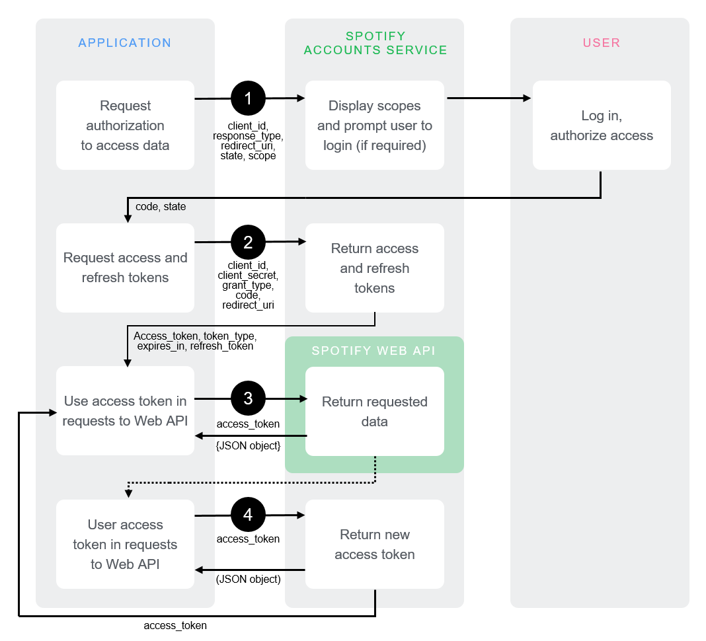

## Background

Recently, I learnt about Github Actions from this [really cool guy](https://galenwong.github.io/blog/2020-08-16-youtube-mymix/) and how we can take advantage of that to run regular jobs. Given that I had always wanted to try to do something with  [Spotify for Developers](https://developer.spotify.com/), I decided to give it a shot and write a script that automatically updates my favorite music list based on my recent Spotify favourites. 

<p align="center">


</p>

> <details>
> <summary> > Click to say hello to Spotify-chan</summary>
> 
> 
> 
> </details>


### What is Github Actions?

[Github Actions](https://github.com/features/actions) is essentially a tool provided by Github to automate your workflows and to provide CI/CD inside of Github itself. What does that mean? I learnt that at a simple level, it means that we can configure Github to run workflows (scripts, job) that enable us to: build a container, deploy a web service, test your application etc. 

Since I want to build an automated job that will update my favourites music list and then display it onto this website, I will need to utilize Github Actions.

Hence, I split the task into two:
1. Write the script to update the music list first. 
2. Figure out how to automatically run that script via Github Actions later.

## Spotify API

First step is to set up a Spotify Developer account and complete the necessary steps to obtain the credentials. 

> Credentials for what?

After investigating into the Spotify Developers API, it looks like we want to use the [get user's saved tracks](https://developer.spotify.com/documentation/web-api/reference/#endpoint-get-users-saved-tracks) API to get all the tracks that I have liked on Spotify:

```txt
GET https://api.spotify.com/v1/me/tracks
```

Since this requires an authentication token, we need to use one of Spotify's authorization flows to obtain it. 

### Authentication

There are four main authentication flows:

1. Refreshable user authentication: [Authorization Code Flow](https://developer.spotify.com/documentation/general/guides/authorization-guide/#authorization-code-flow)
2. Refreshable user authentication: [Authorization Code Flow with Proof Key For Code Exchange (PKCE)](https://developer.spotify.com/documentation/general/guides/authorization-guide/#authorization-code-flow-with-proof-key-for-code-exchange-pkce)
3. Temporary user authentication: [Implicit Grant](https://developer.spotify.com/documentation/general/guides/authorization-guide/#implicit-grant-flow)
4. Refreshable app authorization: [Clients Credentials Flow](https://developer.spotify.com/documentation/general/guides/authorization-guide/#client-credentials-flow)

At first glance, it seems that number four, seems very attractive because it's designed for server to server communication.


<p align="center">


</p>

As seen in the diagram above, all we need to do is save our `client_id`, `client_secret`, and `grant_type` in some sort of environment variable, and then all the script needs to do is to request the access token from Spotify via another API, and then we can use that access token to call the `get user's saved tracks` API. 

But unfortunately, this doesn't work like we expect it to.

<p align="center">


</p>

Yes, the reason why it doesn't work is because this authorization flow does not include
**authentication**, which means that we are unable to access user information (even though we supplied it our `client_id` and `client_secret`). To learn more, you can read about IETF policy from [RFC 6749](https://datatracker.ietf.org/doc/html/rfc6749).

> Great, now that 30 minutes of my life was wasted, let's try another authentication flow.

After looking, it seems that the next best option that fits our purpose is the **authorization code flow**.

<p align="center">


</p>

This authorization code flow will require a bit of manual work from us. First, we still use our `client_id` (obtainable from your Spotify Developer Account Project's dashboard), as well as some parameters to request an `authorization code`. This will probably open up a browser window where you will need to login through your Spotify account.

The docs give pretty detailed instructions, but the link to request looks like this:

```txt
https://accounts.spotify.com/authorize?client_id={client_id}&response_type=code&redirect_uri={some_redirect_uri}&scope=user-library-read%20playlist-modify-public%20&state={optional}
```

It is important to note that you will need the `user-library-read` as one of your scopes. The way these scopes work is that we can control what the authorization token that we obtain, is allowed to do. This is safer because if this token somehow gets leaked, it can only do what you allowed it to do, hence the hacker can only "read from our song library", instead  of being able to, let's say, "delete all your playlists". This is why you should only include the scope that you require for your code. However, I also had to include the `playlist-modify-public` scope because I ended up doing some playlist modifying at the end.

> You will need to add the redirect\_uri as a redirect\_uri in your Spotify Developer Project's dashboard.

After obtaining the **authorization code**, you can use this code to (manually) request for an `access_token` and `refresh_token`. This `refresh_token` is the one that we need. From now on, whenever we run our script, the script first needs to use the `refresh_token` to request a **new** `access_token`. It can then use this `access_token` to do API requests on the Spotify Web API.

If you're confused, just follow the [step by step instructions](https://developer.spotify.com/documentation/general/guides/authorization-guide/#authorization-code-flow) on the documentation which gives a detailed guide on how to obtain the access token.

### Using the Web API

So I've been talking about "the script this", "the script that". But how are we going to write it? That should be very simple using the `requests` library in Python. So let's get started.

First, let's load in the credentials that we just obtained.

```py
CLIENT_ID = os.environ['CLIENT_ID']
CLIENT_SECRET = os.environ['CLIENT_SECRET']
REFRESH_TOKEN = os.environ['REFRESH_TOKEN']
```

<p align="center">


</p>

Wait what, what's `CLIENT_SECRET`? So `client_id` and `client_secret` can both be obtained in your Spotify Developer dashboard, while `REFRESH_TOKEN` is the token that you just obtained from the authentication flow. Make sure to never leak it. I recommend that you save these variables in a `credentials.json` file, and then add these variables as [secrets](https://docs.github.com/en/actions/reference/encrypted-secrets) in your Github repository. You can then add these secrets as environment variables when running the script. That is what I did here too using  `os.environ`. (More on this later).

Next step, we need to use our refresh token to create our access token. 

```py
auth_string = CLIENT_ID + ':' + CLIENT_SECRET
auth_encoding = 'Basic ' + str(base64.b64encode(auth_string.encode("ascii")).decode())

auth_r = requests.post('https://accounts.spotify.com/api/token', data={'grant_type': 'refresh_token', 'refresh_token': REFRESH_TOKEN}, headers={'Authorization': auth_encoding})

res = auth_r.json()
ACCESS_TOKEN = res['access_token']
```

The above code first builds the `auth_encoding`, which is a special string format that Spotify requires as the authorization format. The special string has the form:

```txt
Basic base64_encoded(CLIENT_ID:CLIENT_SECRET)
```

After building the `auth_encoding`, we just pass in the arguments required (as specified in authorization flow guide) to the `https://accounts.spotify.com/api/token` API and then we will have our `ACCESS_TOKEN` that we can use to call the Spotify API.

After this, we just need to call the **get user's saved tracks** API to get our most recently liked songs:

```py
# Get the 25 most recently liked tracks
tracks_r = requests.get('https://api.spotify.com/v1/me/tracks?limit=25', headers={'Authorization': auth_string_bearer})

ul_list = []
random.seed()

# Pick 10 random tracks from those 25 tracks
random_list = random.sample(range(25), 10)
liked_tracks = tracks_r.json()['items']

# Extract the track name, artist, and URL for those tracks
for index in random_list:
    track = liked_tracks[index]
    song_url = track['track']['external_urls']['spotify']
    name = track['track']['name']
    artist = track['track']['artists'][0]['name']
    artist_url = track['track']['artists'][0]['external_urls']['spotify']
    ul_list.append(f'<li><a href=\'{song_url}\'>{name}</a> - <a href=\'{artist_url}\'>{artist}</a></li>')

ul_list = "\n".join(ul_list)
ul_list = f'<ul>{ul_list}</ul>'

# Inject the list into our file as HTML

start_marker = '{/* SPOTIFY MIX STARTS HERE */}'
end_marker = '{/* SPOTIFY MIX ENDS HERE */}'

with open(filepath, 'r', encoding='utf-8') as f:
    oldfile = f.read()
start_index = oldfile.index(start_marker) + len(start_marker)
end_index = oldfile.index(end_marker)

newfile = oldfile[:start_index] + '\n' + ul_list + '\n' + oldfile[end_index:]
with open(filepath, 'w', encoding='utf-8') as f:
    f.write(newfile)
```

The above code basically:
1. Get the 25 most recently liked tracks from the Spotify Web API
2. Pick 10 random tracks from those 25 tracks
3. Extract the track name, artist, and URL for those tracks
4. Inject the list into our file as HTML (in my case, I chose to inject it into my "aboutme.js" file that can be viewed [here](https://khxia.github.io/aboutme))

## Github Actions

Since I have already wrote the Python script to update this website, I needed to use Github Actions to run this regularly.


One of the ways to do this is by creating a `.github/workflows` folder in the root directory of the repo. Afterwards, I can create a `deploy.yaml` file that specifies the deployment flow. 

### Github Encrypted Secrets

Before we get to writing the `deploy.yaml` file, there is one more step and that is to add variables that we saved in the `credentials.json` file to the Github Repository that you want to run the Github Action on. Why? Well, it's obvious that we don't want to commit the `credentials.json` file to the Github Repo because otherwise everyone will be able to see the access tokens. 

But if it isn't commited to the Github Repo, how does Github know the value of the access token when it runs our script? The answer to is that is through [Github Encrypted Secrets](https://docs.github.com/en/actions/reference/encrypted-secrets), which allows us to store sensitive information in organizations, repositories, or repository environments.  

> Follow the instructions in the documentation to add `CLIENT_ID`, `CLIENT_SECRET`, `REFRESH_TOKEN`, and `AUTH_CODE` to your Github Repository.

### Setting up the workflow environment

At the top of `deploy.yaml` file, we want to specify the name of our Action and when it will run.

```yml
name: Update music taste
on: 
  push:
    branches:
      - dev2
  schedule:
    - cron: '0 0 * * *'
```

The name of the Action is the name you will see on the 'Actions' tab on Github when you it runs. We use the `on` key for specifying when we want this Action to be run. In this case, I want it to run when someone pushes onto the `dev2` branch of the repository, as well as a cronjob that runs every 24 hours. 

Next step, is to set up job that we will run, as well as the steps that we need to take. 

```yml
jobs:
  update-aboutme-page:
    name: spotify music
    runs-on: ubuntu-latest
    steps: 
      - uses: actions/checkout@v2
      - name: Set Up Python
        uses: actions/setup-python@v2
        with:
          python-version: 3.8
      - uses: actions/cache@v2
        name: configure pip caching
        with:
          path: ~/.cache/pip
          key: ${{ runner.os }}-pip-${{ hashFiles('**/requirements.txt') }}
          restore-keys: |
            ${{ runner.os }}-pip-
      - name: Install Python dependencies
        run: |
          python -m pip install -r requirements.txt
```

For our purposes, we can imagine that we are running our script on a completely clean machine (on the latest ubuntu distro) that has nothing installed on it. Hence, we need to do some set up first. This involves:

1. Checkout the current reposistory so the workflow can access it (note that only a **single commit** is fetched by default). 
2. Set up Python (with version 3.8)
3. Configure pip caching so that we can install our dependencies faster.
4. Actually install our dependencies. (In my case, I have a `requirements.txt` file with the needed Python dependencies to run our script)

Note that I am not actually running any commands myself. I am using the `uses` key to use the custom Actions that other people wrote. 

> Why?

Well because, fetching a repo, setting up Python, and configuring pip caching are quite common steps that many people will use when setting up their environment. So why should we keep copy pasting? Hence, it is much more maintainable and cleaner to use the custom Actions that other people write (almost like importing a library) to achieve the same purpose - no need to copy and paste a bunch of commands to run. 

You'll see that for the 'install python dependencies' step, we actually do need to `run` our own command to install dependencies: `python -m pip install -r requirements.txt`. 

### Running our script

Now, we can actually run our script as our next `step`. 

```yml
- name: Write Spotify Mix
    env: 
        CLIENT_ID: ${{ secrets.SPOTIFY_CLIENT_ID }}
        CLIENT_SECRET: ${{ secrets.SPOTIFY_SECRET }}
        REFRESH_TOKEN: ${{ secrets.SPOTIFY_REFRESH_TOKEN }}
        AUTH_CODE: ${{ secrets.SPOTIFY_AUTH_CODE }}
    run: |
        python write_spotify_songs.py
```

Quite self-explanatory. We `run` our Python script that I named `write_spotify_songs.py`. Notice that we can access the secrets that we added by using: `${{ secrets.MY_SECRET }}`, after which we can then pass it as a value into Python's `os.env` variable. 

### Finishing up

So now that we've run our Python script and have edited the file to show the new Spotify list, we now need to let everyone know about it. Right now, the new file only exists on one of Github's Ubuntu machines, we need to do two things:

1. Commit and Push the changes onto the Github Repo
2. Build and Publish the new Gatsby page using Github Pages.

Thankfully, there are already custom Actions that do this for us. We simply have to use them:

```yml
uses: stefanzweifel/git-auto-commit-action@v4
name: commit and push
with: 
    commit_message: "Update Spotify Mix"
    file_pattern: src/pages/*.js
    commit_user_name: 'my_spotify_mix_bot'
    push_options: '--force'
- uses: enriikke/gatsby-gh-pages-action@v2
name: Deploy to github pages
with:
    access-token: ${{ secrets.PERSONAL_ACCESS_TOKEN }}
    deploy-branch: master
```

You'll see that it's quite self-explanatory. We commit all files with the `file_pattern: src/pages/*.js`, and we can also set a commit username (by default, it will use your Github username). It's also worth noting that:

* Since the branch we pull and push from is the `dev2` branch, when deploying to Github Pages, we need to specify our `deploy-branch`. In this case, I personally use the `master` branch for deploying to Github pages
* To deploy to Github Pages, you will need to also add a `PERSONAL_ACCESS_TOKEN` to your Github Secrets. Is it safe to pass your `PERSONAL_ACCESS_TOKEN` into someone else's program? Probably not. But we can overlook that for the convenience that it gives us. (Gatsby build and deployment is a pain).

Now, my website now looks like this:

<p align="center">


</p>

## Taking Advantage of Free Computing Power

Great! We've done what we came here to do! Github lets us incorporate CI/CD for our project for free! But is that all we can do? 

Of course not! You'll notice that all we did was write a Python script that did stuff that was relevant to our project. But in fact, we could just write any random Python script to do tasks unrelated to the project and it would work just fine!

Don't want to pay for a server? Don't want to deal with annoying server-side stuff? Just need to run a few scripts/programs regularly on a cronjob? No problem! Just create a new repository, set up the environment and then you're good to go! Github is really too generous and rich. 

<p align="center">


</p>

### Applying that to myself

As an example of how I took advantage of this, I decided that I shouldn't waste the hard-work that it took to create the Spotify access token, and try to solve one of my Spotify related problems:

* Premise:
  * I have a 'general' playlist, that is basically a carbon copy of my 'Liked Songs' library. I like to have this playlist because it's the playlist I pretty much only listen from (I'm weird I know), and I sometimes like to show people what playlist I normally listen.
* Problem:
  * The problem is that every time I 'like' a song, it automatically gets added to the 'Liked Songs' library at the top. But when I select 'add to playlist', it gets added at the bottom of the 'general' playlist. This means when I play the 'general' playlist from the top, it messes up the order of the playlist. Even if I can sort the playlist by date added, it still requires an extra step to add the song to the playlist when I can just click 'like'.
* Solution:
  * All I need, is for my current Python script to: 
    * Get the most recent 'Liked Songs'
    * Get the 'general' playlist
    * If you see a song in 'Liked Songs' that doesn't exist in 'general', prepend that song to the playlist. 

And so, the code looks something like this:

```py
def find_index_of_latest_song(most_recent, liked_songs):
    ''' Finds the index in liked_songs that matches the most recent song in general_playlist '''
    result = 0
    for song in liked_songs:
        name = song['track']['name']
        artist = song['track']['artists'][0]['name']
        if name == most_recent['name'] and artist == most_recent['artists'][0]['name']:
            return result
        else:
            result = result + 1
    return -1

# After writing the new song list to the file:

# UPDATING "GENERAL" PLAYLIST IF NEEDED
# Playlist ID: 0fiu2hnAUGutQdNXuoQ46n

# Get playlist
GENERAL_PLAYLIST_ID = '0fiu2hnAUGutQdNXuoQ46n'
playlist_r = requests.get(f'https://api.spotify.com/v1/playlists/{GENERAL_PLAYLIST_ID}?fields=tracks(items(track(name, uri, artists(name))))', headers={'Authorization': auth_string_bearer})

general_playlist = playlist_r.json()
index = find_index_of_latest_song(general_playlist['tracks']['items'][0]['track'], liked_tracks)

# after we find our index, we just need to add all the songs from position 0 to index into our playlist
if index > 0 and index <= 25:
    uri_list = []
    for pos in range(index):
        uri = liked_tracks[pos]['track']['uri']
        uri_list.append(uri)
    uri_list = ",".join(uri_list)
    requests.post(f'https://api.spotify.com/v1/playlists/{GENERAL_PLAYLIST_ID}/tracks?position=0&uris={uri_list}', headers={'Authorization': auth_string_bearer, 'Content-Type': 'application/json'})
```

And now, it just works like a charm. My 'Liked Songs' library and 'general' playlist is completely in sync. And because of Github Actions, I get to do this syncing completely for free!

> It should be noted that Spotify probably already provides an easier way to do this, but just let me have my big brain moment.

<p align="center" >


</p>

## Conclusion

There we have it. I have learnt to run a simple cronjob using Github Actions that updates my website using data from a web API. There is so much more that we can do with Github Actions and there are a lot of custom Actions out there that make CI/CD so much more simpler for us. So go out there, have a look and explore! 

Feel free to reference the code for this website on Github!
